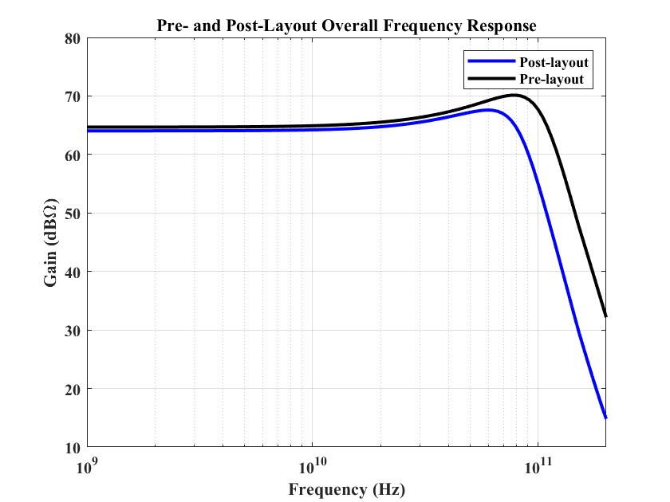
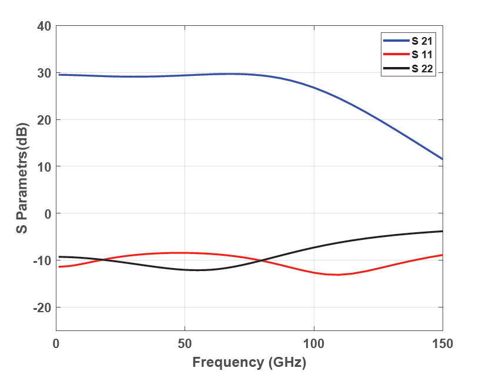
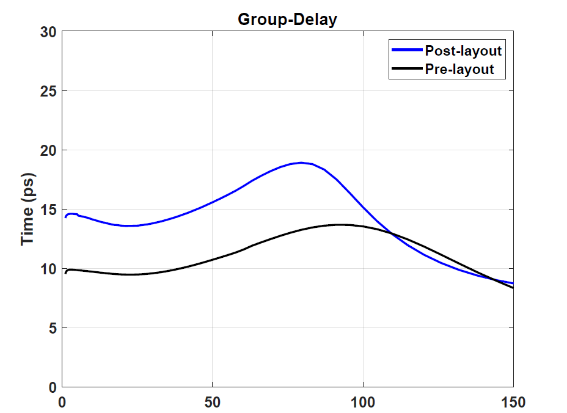
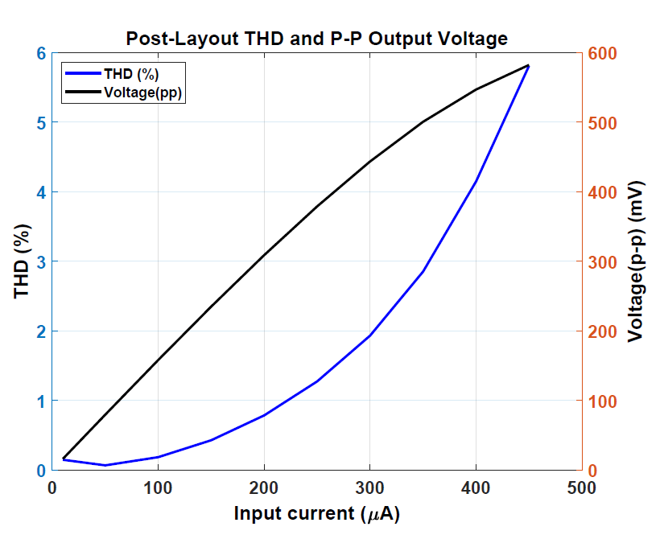
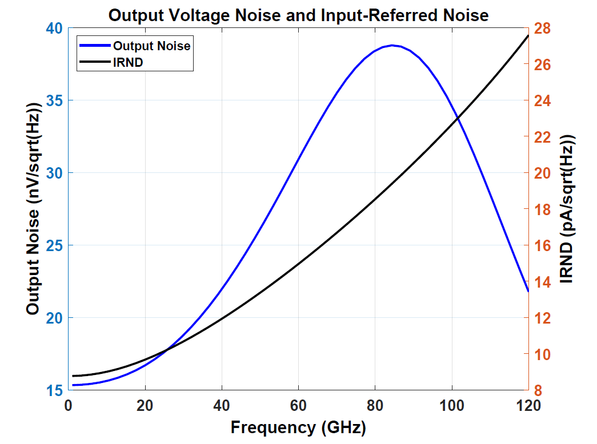
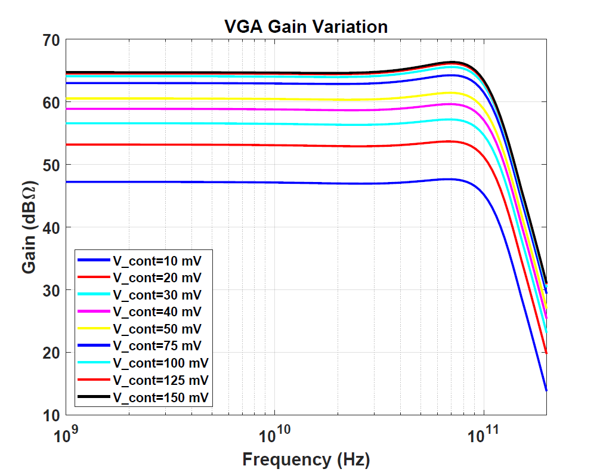
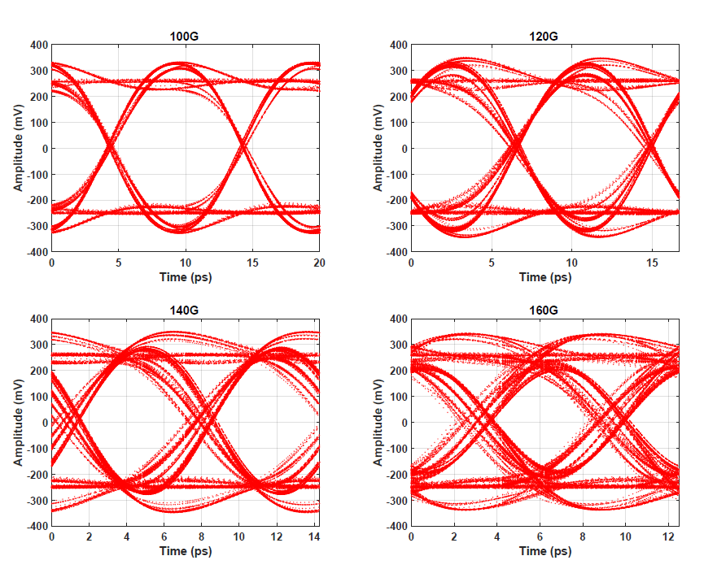
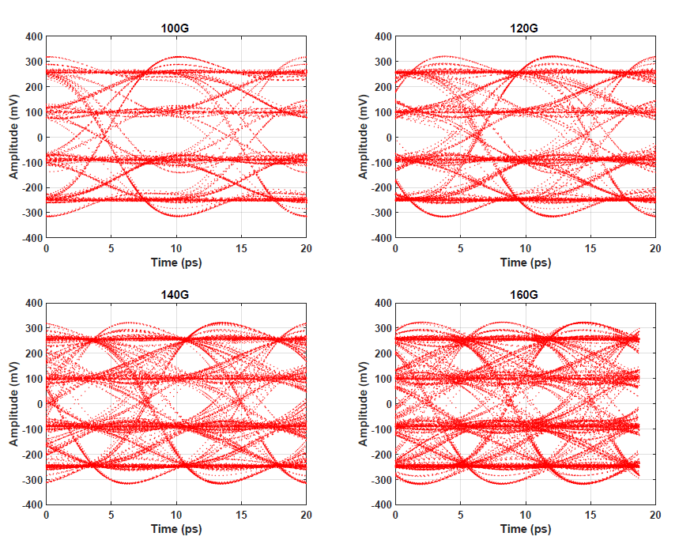

# Fully Differential TIA for Coherent Receiver
Designed a high-speed fully differential TIA for coherent optical receiver. 
## Key Specs
| Performance Parameter | Achieved Value |
| :--- | :--- |
| Photodiode Capacitance | 25 fF |
| Transimpedance Gain | 64 dB $\ohm$ | 
| Bandwidth | 80.93 GHz |
| Input-Referred Noise | 14.37 pA/sqrt (Hz) |
| Group-Delay Variation | 5 ps | 
| THD | 3% @ 10 GHz, with 10 Harmonics | 
| Dynamic Range | 37 dB | 
| Output Voltage (p-p) | 500 mV |
| Power Dissipation | 300 mW | 
| DC Offset Compensation | 5 mA | 

## Circuit Schematic and Layout
[Shunt Feedback Topology](SFTIA.png)
[Four Quadrant Multiplier VGA](VGA.png)
[Emitter Follower](EF.png)
[Output Buffer](Buffer.png)
[Testbench Setup](Top_view.png)
[Shunt Feedback Topology (Layout)](./Thesis_Figures_png/SFB_layout.png)

## Post-Layout Simulation Results

<figure>
  
  <figcaption><b>Fig:</b> Pre- and Post-Layout Overall Frequency Response.</figcaption>
</figure>

<figure>
  
  <figcaption><b>Fig:</b>Gain Normalized at Maximum Value- Multistage Equalization.</figcaption>
</figure>

<figure>
  
  <figcaption><b>Fig:</b>|𝑆_11 |, |𝑆_22 |<−10 dB up to 80 GHz. </figcaption>
</figure>

<figure>
  
  <figcaption><b> Fig:</b>5 ps at aroung 80 GHz.</figcaption>
</figure>

<figure>
  
  <figcaption><b> Fig:</b>THD=3% at 10 GHz and 10 Harmonics, 500mV p-p Output voltage</figcaption>
</figure>

<figure>
  
  <figcaption><b> Fig:</b>Avereage Input Referred Noise=14 pA/sqrt(Hz) upto 100 GHz.</figcaption>
</figure>

<figure>
  
  <figcaption><b> Fig:</b>37 dB dynamic range varying control voltage from 1mV to 150 mV.</figcaption>
</figure>

<figure>
  
  <figcaption><b> Fig:</b>NRZ</figcaption>
</figure>

<figure>
  
  <figcaption><b> Fig:</b>PAM4</figcaption>
</figure>

<figure>
  
  <figcaption><b> Fig:</b>Input DC Current Compensation (Low cur off frequency =250 KHz)</figcaption>
</figure>

<figure>
  
  <figcaption><b> Fig:</b>Corner Simulation</figcaption>
</figure>

